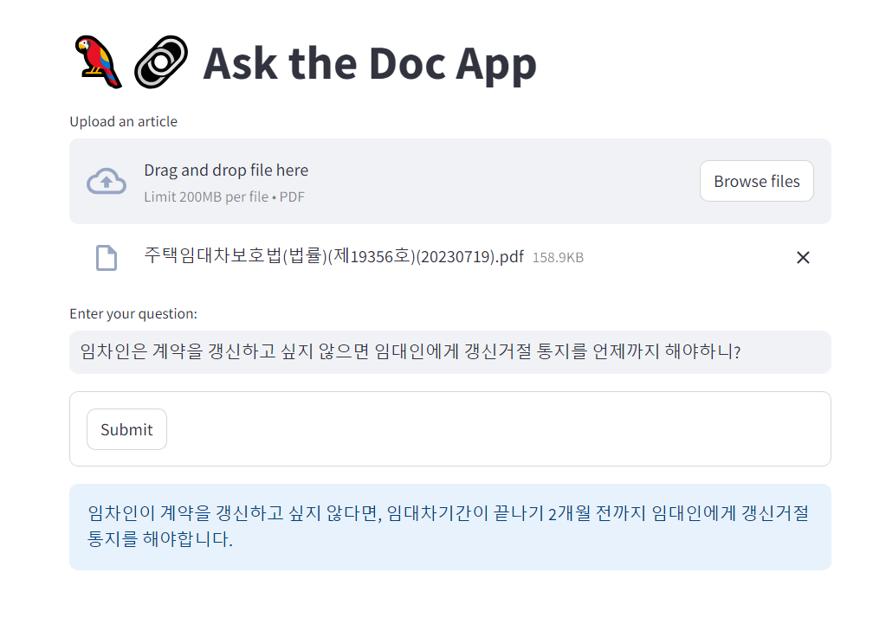

# 🦜🔗 문서 기반 질문 답변 챗봇 (doc-llm-qa)

**문서 기반 질문 답변 챗봇**은 사용자가 업로드한 PDF 문서를 바탕으로 질문에 대한 답변을 생성해주는 챗봇입니다.




## 🌟 **핵심 기능**

- **PDF 텍스트 추출**: PDF의 내용을 손쉽게 텍스트로 변환할 수 있습니다. (`pdfminer` 활용)
- **적절한 텍스트 분할**: 주어진 텍스트를 적절한 크기의 섹션으로 나눕니다. (`CharacterTextSplitter` 활용)
- **텍스트 임베딩 & 저장**: 빠르고 효율적인 텍스트 검색을 위해 임베딩을 생성하고 저장합니다. (`Chroma`, `OpenAIEmbeddings` 활용)
- **문서 검색 기능**: 사용자의 질문과 관련된 문서를 효과적으로 찾아냅니다.
- **자동 답변 생성**: GPT-4 모델을 기반으로 정확한 답변을 생성합니다.


## 🚀 **시작하기**

1. 아래의 명령어를 사용하여 프로젝트를 클론합니다:
```bash
git clone https://github.com/jiwoochris/doc-llm-qa.git
```

2. 새로운 conda 환경을 생성하고 활성화합니다:
```bash
conda create -n "doc"
conda activate doc
```

3. 필요한 라이브러리들을 설치합니다:
```bash
pip install -r requirements.txt
```

4. 프로젝트를 실행합니다:
```bash
streamlit run demo.py
```